## 元タワレコ店員
## ×
## Perl
## ×
## Webサービス

[@koba04](https://twitter.com/koba04)

[PerlCasual#5](http://atnd.org/events/37158)

タワレコ店員からエンジニアになってしばらくは

人月という値札を付けられて働いていたが、、
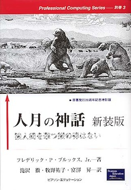

### すべてはこのスライドから..!?

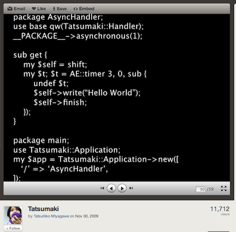
[http://www.slideshare.net/miyagawa/tatsumaki](http://www.slideshare.net/miyagawa/tatsumaki)

Shibuya.pm #12

### 自己紹介
* [Toru Kobayashi](http://about.me/koba04)
* #1982
* koba04 ([twitter](https://twitter.com/koba04) / [github](https://github.com/koba04) / [blog](http://d.hatena.ne.jp/koba04/)...)
* MobileFactory

### こんなのとか
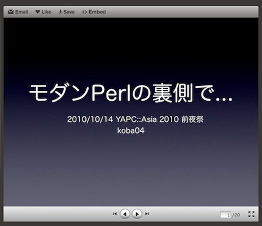
[http://www.slideshare.net/koba04/perl-yapcasia2010](http://www.slideshare.net/koba04/perl-yapcasia2010)

YAPC::ASIA 2010 前夜祭 (LT)

### こんなのとか
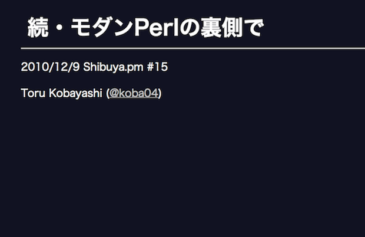
[http://koba04.com/slide/shibuyapm15/](http://koba04.com/slide/shibuyapm15/)

Shibuya.pm #15 (LT)

### こんなのとか
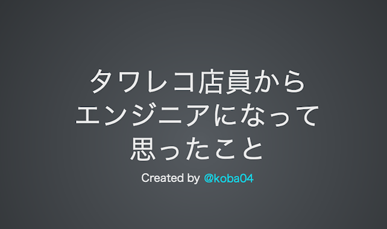
[http://koba04.com/slide/become\_a\_programmer/](http://koba04.com/slide/become_a_programmer/)

reveal.jsの力ではてブのTOPに載ってえらい読まれて焦る..

# その結果

### 執筆もさせて頂きました
SoftwareDesign 4月号(発売中!)

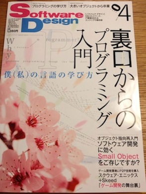

特集「裏口からのプログラミング入門」
[http://gihyo.jp/magazine/SD/archive/2013/201304](http://gihyo.jp/magazine/SD/archive/2013/201304)

### がしかし、
今回はどう勉強してきたかといった話はあまりしません
SoftwareDesign読んでください！

## 話すこと
カジュアルな話です

***
* 個人でWebサービスを作ることに考えたこと
* 作ってみた
* Perlと私
***

## 今日はCasualですよ

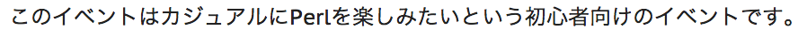
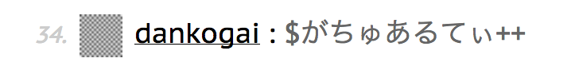

## Webサービスを
## 作ることは難しい?

## 規模によるけど
## 敷居は高くない

ライブラリや情報が沢山あるので有効活用

* Amon2, Mojolicious (Perl)
* jQuery (JavaScript)
* Bootstrap, Flat UI (JavaScript, CSS)

## なんで作るのか?

## 楽しいから

* 誰にも文句言われずに好きなように出来る
* 試してみたい技術も試し放題!!
  * Carton+Plenv、Redis、CoffeeScript...
* 反応がもらえる

# アイデア

## アイデア

* **自分が使いたいと思えるかどうか**
* 運用・メンテナンス性はどうか
  * 放置していても成立するコンテンツが望ましい
* アイデアが先が技術が先か

# つくる

## つくる

* **ミニマルスタートでまずは動くものを**
  * モチベーションは有限

* 技術的選択
  * 早く実装する技術とモチベーションを保つ技術

# デザイン

## デザイン

* こだわりがないからBootstrapなどのフレームワーク使うのが楽でいい
* 勉強のために自分で頑張るのもアリだとは思う..
* Compass便利(プログラマブルにCSS書ける)

        footer {
            color: $base-color;
            margin-left: 10px;
            a {
                &:link, &:visited {
                    color: $base-color;
                }
                &:hover {
                    color: $highlight-color;
                }
            }

[http://compass-style.org/](http://compass-style.org/)

## 最初につくったもの

### CountDownLastFMRanking
2011/08〜

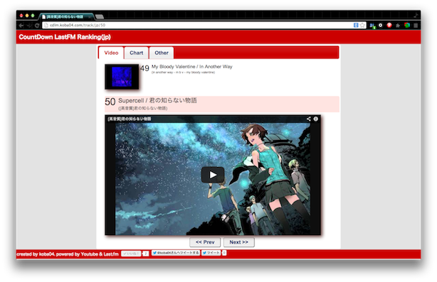

[https://github.com/koba04/p5-cdlm](https://github.com/koba04/p5-cdlm)

## 何?
* LastFMの国ごとのランキングの曲をYouTubeから取ってきて、カウントダウンで連続再生するサービス
* HTMLのtitleを動画名にすることでタブ開かなくても動画名を確認できるように
* 今は日本とアメリカとイギリスのみ対応
* 取得する動画の精度向上が課題

## 技術的なこと
* Plack::Builder, Plack::Request使ってapp.psgiでルーティングなどを処理
  * オススメなアプローチではない
* TemplateはText::Xslate
* Cacheは最初はKyotoTycoon使っていたけど途中でMemcachedに置き換えた
  * Redis試したい
* 最近CoffeeScriptに置き換えた

## app.psgi

    if ( $req->path eq '/' ) {
        $response = $tx->render('index.tx');
    } elsif ( $country && $req->path =~ m{/track/(?:jp|us|uk)(?:/(\d{1,2}))?$} ) {
        $response = $tx->render('track.tx', { country => $country, rank => $1 });
    } elsif ( $country && $req->path =~ /\.json$/ ) {
        my $from = 'JP';
        my $rank = CDLM::Cache->new->get_callback(
            $country . '_' . $from,
            sub {
                CDLM->track($country, $from);
            },
            # 8days
            60 * 60 * 24 * 8,
        ) || [];
        $response = to_json($rank);

## main.coffee

    class CDLM
      play: (mode, playIndex) ->
        @index = playIndex if playIndex
        # 動画なかったらさらに次へ
        while not @videoList[@index] or not @videoList[@index].video
          if mode is 'prev'
            # これ以上戻れない
            return if @index >= @rankMax
            ++@index
          else
            # これ以上先はない
            return if @index <= 1
            --@index
        @player.loadVideoById @videoList[@index].video.id if not @init

## デザイン
* 色の組み合わせはLast.FMの丸パクリ...

## 作ってみて

* 自分以外ほとんど使ってない気がするけど、毎週使っている
* 新しいアーティストや新譜を発見出来た
  * 相対性理論、supercell...
* 個人的には動画の精度以外は満足している

## 次につくったもの

## PetaTube
2012/10〜

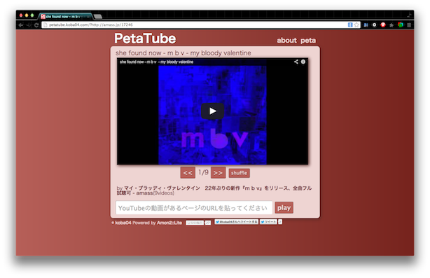

[https://github.com/koba04/p5-petatube](https://github.com/koba04/p5-petatube)

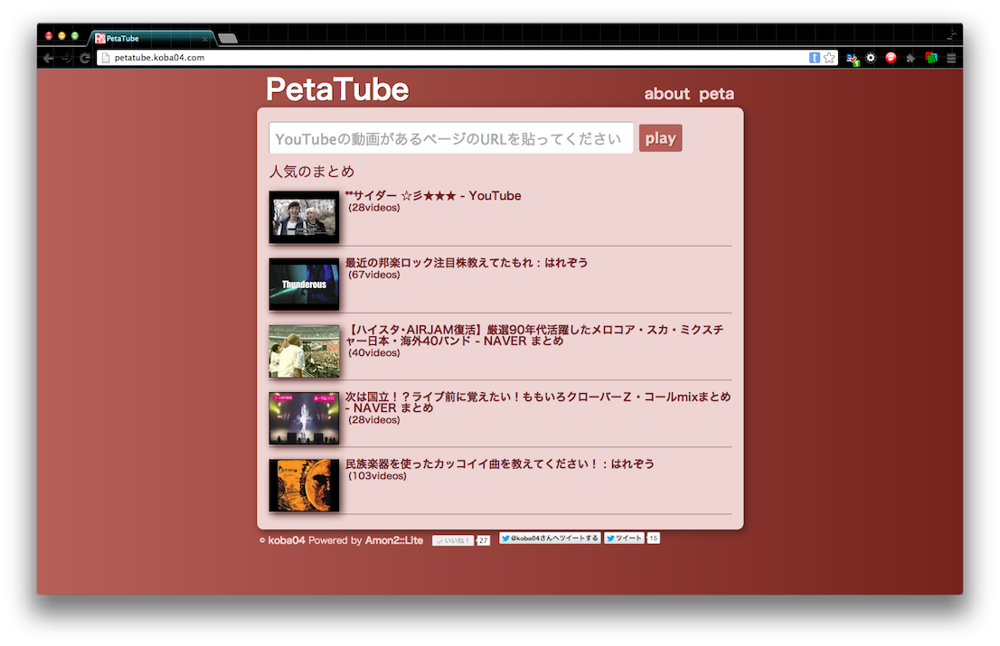

## 何?
* YouTubeのまとめサイトなどの動画をまとめて連続再生
* Naverまとめはページングにも対応
* HTMLのtitleを動画名にすることでタブ開かなくても動画名を確認できるように
* シャッフル再生
* ブックマークレット

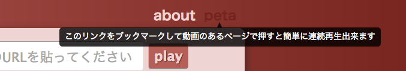

### YouTubeサイト内にも対応

某室長からの要望に応えて対応

    12:46 aXX: 参考までにきくんだけど http://www.youtube.com/user/cotorich/videos とかも連続再生できるのかな?
    12:47 kobayashi: できますよｗ
    12:47 kobayashi: ページングはしませんがｗ
    12:48 aXX: さんきう

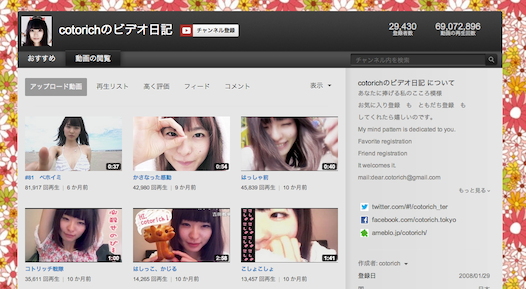
[http://www.youtube.com/user/cotorich/videos](http://www.youtube.com/user/cotorich/videos)

## きっかけ

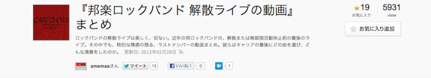
[http://matome.naver.jp/odai/2132876130063084301](http://matome.naver.jp/odai/2132876130063084301)

(NHN Japan++)

### PetaTubeを構成する技術

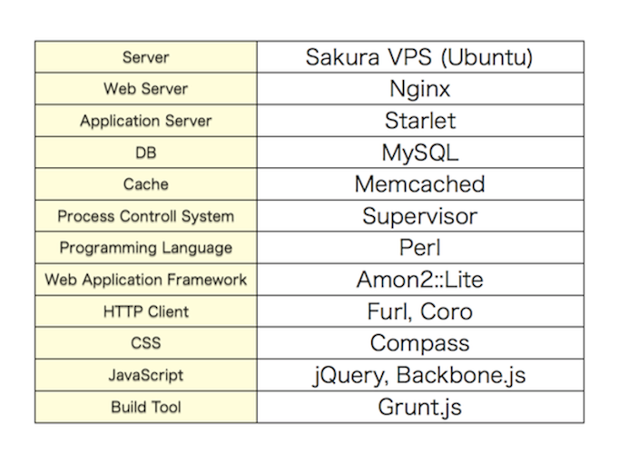

Redisに(ry

## Amon2

* Amon2::Liteを使用してapp.psgiに書いちゃってる
* レンダリング後はJSONでやりとりするだけ

            get '/api/page' => sub {
                my $c = shift;
                my $url = $c->req->param('url') || '';
                my $video_ids = [];
                my $title = '';
                if ( $url ) {
                    my $result = PetaTube->extract_video_ids($url);
                    $video_ids = $result->{ids};
                    $title = PetaTube::Hot->record($url, $result->{title}, $video_ids)->title;
                }
                return $c->render_json({
                    video_ids   => [ map { {id => $_} } @$video_ids ],
                    url         => $url,
                    title       => $title,
                });
            };

## Furl+Coro
* Naverまとめの場合はページングにも対応しているので、ページング先もCoroで並列に取得している
* 取得した結果はMemcachedに

            my $youtube = WebService::YouTube::Lite->new;
            my $video_ids = [];
            my @coros;
            for my $page ( @pages ) {
                push @coros, async {
                    my $paging_url = $uri->clone;
                    $paging_url->query_form(page => $page);
                    my $res = $youtube->extract_video_ids($paging_url);
                    push @$video_ids, @{ $res->{ids} };
                }
            }
            $_->join for @coros;
            return $video_ids;

## murmurhash
* URLをmurmurhashしたものにindex貼っている

        # schema
        digest      INTEGER UNSIGNED    NOT NULL,
        url         TEXT                NOT NULL,
        :
        INDEX url_digest(digest),

        # code
        use Digest::MurmurHash qw/murmur_hash/;
        my $row = $db->single(peta => {
            digest  => murmur_hash($url),
            url     => $url
        });

## フロントサイド
* Backbone.js
* Compass
* Grunt.js

省略...

## YouTube

* iframe apiのものを使用してiphoneなど非Flash端末でも表示されるように

          // https://developers.google.com/youtube/iframe_api_reference
          window.onYouTubeIframeAPIReady = $.proxy(function () {
            this.player = new YT.Player('video', {
              height: '425',
              width: '760',
              videoId: video.id,
              events: {
                'onStateChange': $.proxy(function (e) {
                  var state = e.data;
                  if (state === YT.PlayerState.ENDED) {
                    this.next();
                  }
                }, this),
                'onError': $.proxy(function () {
                  this.skip();
                }, this)
              }
            });
          }, this);

[http://d.hatena.ne.jp/koba04/20121030/1351526950](http://d.hatena.ne.jp/koba04/20121030/1351526950)

## 作ってみて
* 欲しかったと言ってくれる人もいて嬉しかった
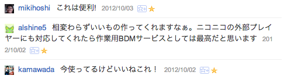
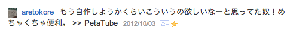
* 自分自身も時々使っていて便利
* タグの機能を入れたい
* ニコ動対応も気が向いたらやりたい...

# おまけ

### NodeKaraokeSlide
* 写真に歌詞を載せてiPhoneから操作できるツール
* 友達の結婚式で一緒に「乾杯」を生演奏で歌いたかった
* それKeyNoteで...というのもあるけど、友だちのためにWebの技術を使いたという自己満足のために作った
* node + socket.io + connect で実装

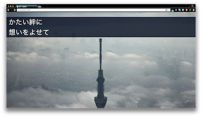

[https://github.com/koba04/node-Karaoke-Slide](https://github.com/koba04/node-Karaoke-Slide)

# Perlと私

## カジュアルなPerl Mongers

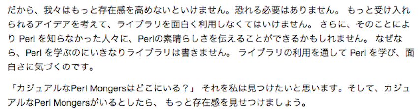
[http://yusukebe.com/archives/20090912/120113.html](http://yusukebe.com/archives/20090912/120113.html)

### 使うことで貢献したい

* 今の自分にはAmon2やTengは作れないけど...
* 素晴らしいライブラリがあるからこんな簡単にアプリを作れるよということをアピールしたい!

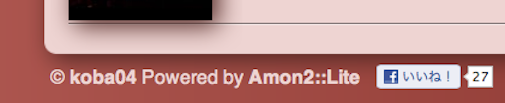

## 自分にきっかけを
## くれたのはPerl

***
* 冒頭で紹介したShibuya.pmでのmiyagawaさんのTalkで
  * **プログラミングは美しい**
* PerlCasualやYAPC::ASIAに参加して
  * **プログラミングは楽しい**
* YAPCとShibuya.pmでLTをして
  * **色んな方と知り合いになれた**
* Perlの会社に転職も出来た
  * **いっぱいプログラミング出来るようになった**
***

## Perlは

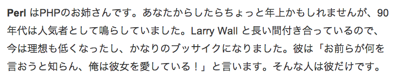

[http://knoh.jp/answers/22cc7d73](http://knoh.jp/answers/22cc7d73)

## こんなコードや

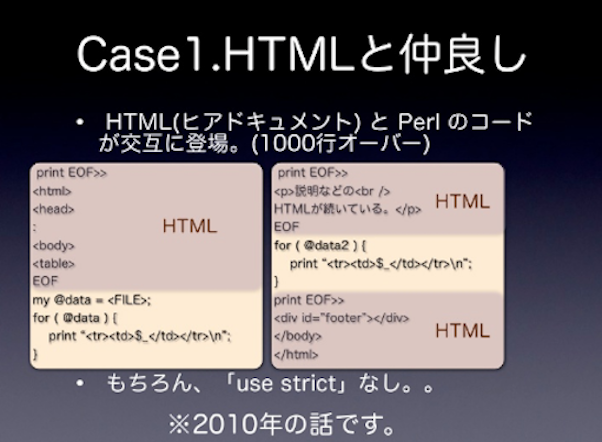

from [モダンPerlの裏側で](http://www.slideshare.net/koba04/perl-yapcasia2010)

## こんなコードばかりでない

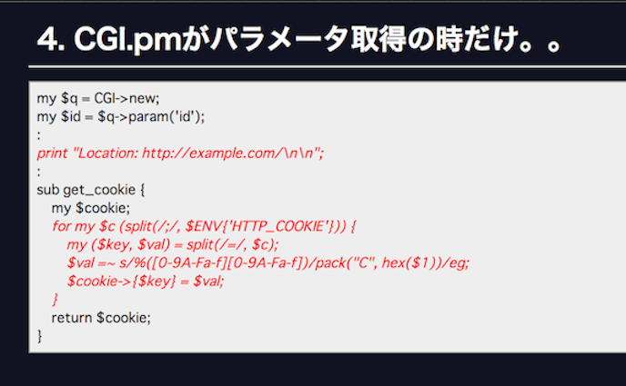

from [続・モダンPerlの裏側で](http://koba04.com/slide/shibuyapm15/)

## シンプルで機能的

    sub call {
        my($self, $env) = @_;

        my $start = [ Time::HiRes::gettimeofday ];
        my $res = $self->app->($env);

        $self->response_cb($res, sub {
            my $res = shift;
            my $req_time = sprintf '%.6f', Time::HiRes::tv_interval($start);
            Plack::Util::header_set($res->[1], 'X-Runtime', $req_time);
        });
    }

[Plack::Middleware::Runtime](https://github.com/plack/Plack/blob/master/lib/Plack/Middleware/Runtime.pm)

## 自分にとってPerlは

***
CPANが素晴らしいとかはもちろんあるけど

面白い人たちが集まっている場所であり

プログラミングは楽しいと思わせてくれた言語
***

# 最後に

## プログラミングを楽しもう

**"楽しいところに人は集まる"**

## そうだ、YAPCにいこう
出会いとやる気をもらえる場
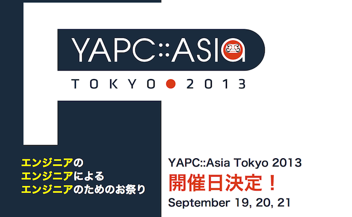
[http://yapcasia.org/2013/](http://yapcasia.org/2013/)

## アウトプットしよう
* 自分が今ここで話をさせてもらっているのもアウトプットしたから
* チャンスは自分で掴むものであり、誰かがくれるもの

## 何が出来るかではなく
## 何をやったか

***
"自分しかできないことはほとんどないけど

自分しかやらないことはある"

### 今日からはじめてみませんか

    $you->perl("enjoy");
    $you->output;
    push @casual_perl_mongers, $you;
    join "Beer", @casual_perl_mongers;

### ご静聴ありがとうございました。

***
[http://koba04.com/slide/perl-casual-5/](http://koba04.com/slide/perl-casual-5/)
